```mermaid
graph TD
    %% =================================================================
    %%  Legend - Defines the shapes and conventions used in this diagram
    %% =================================================================
    subgraph Legend
        direction TB
        L_IDConv(NodeID Convention: TYPE_Name)
        L_Svc([Service / Core Logic])
        L_Auth([AUTH / Authentication])
        L_Util([UTIL / Utility])
        L_Config[/CONFIG or SVC_Init/]
        L_Data[(DATA / Storage)]
        L_Test{{TEST / Automated Test}}
    end

    %% =================================================================
    %%  Environment Setup
    %% =================================================================
    subgraph EnvSetup["Environment Setup"]
        direction TB
        UTIL_RunWrapper([UTIL: Run Wrapper])
        SVC_SetupEnvironment([SVC: Setup Environment])
        UTIL_RunWrapper --> SVC_SetupEnvironment
    end

    %% =================================================================
    %%  Configuration
    %% =================================================================
    subgraph Config["Configuration & Init"]
        direction TB
        CONFIG_Settings[/CONFIG: Settings/]
        CONFIG_SkillDefinition[/CONFIG: Skill Definition/]
        CONFIG_Requirements[/CONFIG: Requirements/]
        SVC_SkillInit([SVC: Skill Init])
    end

    %% =================================================================
    %%  Authentication System
    %% =================================================================
    subgraph Auth["Authentication System"]
        direction TB
        AUTH_Manager([AUTH: Manager])
    end

    %% =================================================================
    %%  Browser Automation
    %% =================================================================
    subgraph Browser["Browser Automation"]
        direction TB
        SVC_BrowserSession([SVC: Browser Session])
        UTIL_BrowserUtils([UTIL: Browser Utils])
        SVC_AskQuestion([SVC: Ask Question])
        SVC_BrowserSession --> UTIL_BrowserUtils
        SVC_AskQuestion --> SVC_BrowserSession
    end

    %% =================================================================
    %%  Notebook Management
    %% =================================================================
    subgraph Notebooks["Notebook Management"]
        direction TB
        SVC_NotebookManager([SVC: Notebook Manager])
    end

    %% =================================================================
    %%  Data Storage
    %% =================================================================
    subgraph Storage["Data Storage"]
        direction TB
        DATA_NotebookLibrary[(DATA: Notebook Library)]
        DATA_AuthInfo[(DATA: Auth Info)]
        DATA_BrowserState[(DATA: Browser State)]
    end

    %% =================================================================
    %%  Cleanup
    %% =================================================================
    subgraph Cleanup["Data Cleanup"]
        direction TB
        SVC_CleanupManager([SVC: Cleanup Manager])
    end

    %% =================================================================
    %%  Missing for MVP - Testing & Retry
    %% =================================================================
    subgraph Missing["Missing for MVP"]
        direction TB
        TEST_AuthFlow{{TEST: Auth Flow}}
        TEST_QueryFlow{{TEST: Query Flow}}
        SVC_RetryLogic([SVC: Retry Logic])
    end

    %% =================================================================
    %%  Cross-subgraph connections
    %% =================================================================

    %% run.py dispatches to all scripts
    UTIL_RunWrapper --> AUTH_Manager
    UTIL_RunWrapper --> SVC_AskQuestion
    UTIL_RunWrapper --> SVC_NotebookManager
    UTIL_RunWrapper --> SVC_CleanupManager

    %% Config used by core scripts
    CONFIG_Settings --> SVC_AskQuestion
    CONFIG_Settings --> AUTH_Manager
    CONFIG_Settings --> SVC_BrowserSession

    %% SkillInit exports all modules
    SVC_SkillInit --> SVC_AskQuestion
    SVC_SkillInit --> AUTH_Manager
    SVC_SkillInit --> SVC_NotebookManager
    SVC_SkillInit --> SVC_CleanupManager
    SVC_SkillInit --> SVC_BrowserSession
    SVC_SkillInit --> UTIL_BrowserUtils

    %% Auth uses storage
    AUTH_Manager --> DATA_AuthInfo
    AUTH_Manager --> DATA_BrowserState

    %% Ask question uses auth
    SVC_AskQuestion --> AUTH_Manager

    %% Notebook manager uses library
    SVC_NotebookManager --> DATA_NotebookLibrary

    %% Cleanup touches all storage
    SVC_CleanupManager --> DATA_BrowserState
    SVC_CleanupManager --> DATA_AuthInfo
    SVC_CleanupManager --> DATA_NotebookLibrary

    %% Missing components integration points
    TEST_AuthFlow --> AUTH_Manager
    TEST_QueryFlow --> SVC_AskQuestion
    TEST_QueryFlow --> SVC_NotebookManager
    SVC_RetryLogic --> SVC_BrowserSession
    SVC_RetryLogic --> SVC_CleanupManager
```

# Noderr - Architectural Flowchart

**Purpose:** This document contains the Mermaid flowchart defining the architecture, components (NodeIDs), and their primary interactions for this project. This visual map is the source of truth for all implementable components tracked in `noderr_tracker.md`.

---

---

## NodeID Reference

### Existing Components (15)

| NodeID | Type | File | Status |
|--------|------|------|--------|
| UTIL_RunWrapper | Utility | scripts/run.py | VERIFIED |
| SVC_SetupEnvironment | Service | scripts/setup_environment.py | VERIFIED |
| AUTH_Manager | Auth | scripts/auth_manager.py | VERIFIED |
| SVC_AskQuestion | Service | scripts/ask_question.py | VERIFIED |
| SVC_NotebookManager | Service | scripts/notebook_manager.py | VERIFIED |
| SVC_BrowserSession | Service | scripts/browser_session.py | VERIFIED |
| UTIL_BrowserUtils | Utility | scripts/browser_utils.py | VERIFIED |
| SVC_CleanupManager | Service | scripts/cleanup_manager.py | VERIFIED |
| CONFIG_Settings | Config | scripts/config.py | VERIFIED |
| SVC_SkillInit | Service | scripts/__init__.py | VERIFIED |
| DATA_NotebookLibrary | Data | data/library.json | VERIFIED |
| DATA_AuthInfo | Data | data/auth_info.json | VERIFIED |
| DATA_BrowserState | Data | data/browser_state/ | VERIFIED |
| CONFIG_SkillDefinition | Config | SKILL.md | VERIFIED |
| CONFIG_Requirements | Config | requirements.txt | VERIFIED |

### Missing for MVP (3)

| NodeID | Type | Priority | Blocking |
|--------|------|----------|---------|
| TEST_AuthFlow | Test | Medium | None |
| TEST_QueryFlow | Test | Medium | None |
| SVC_RetryLogic | Service | High | Reliability |
